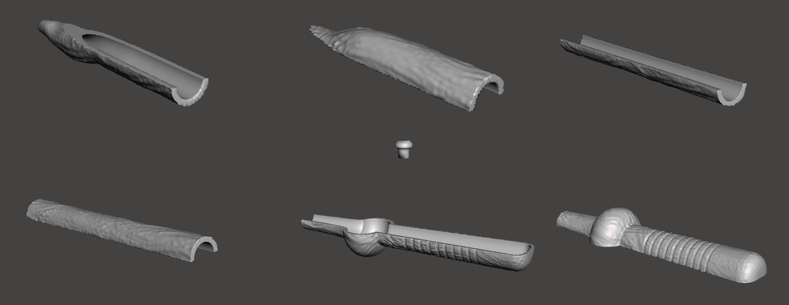
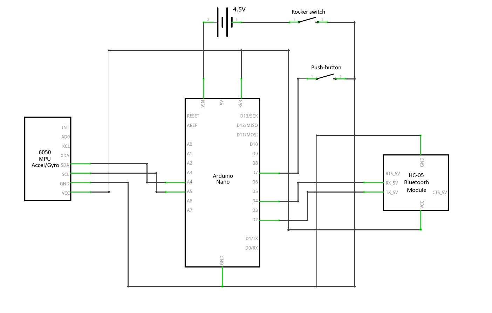
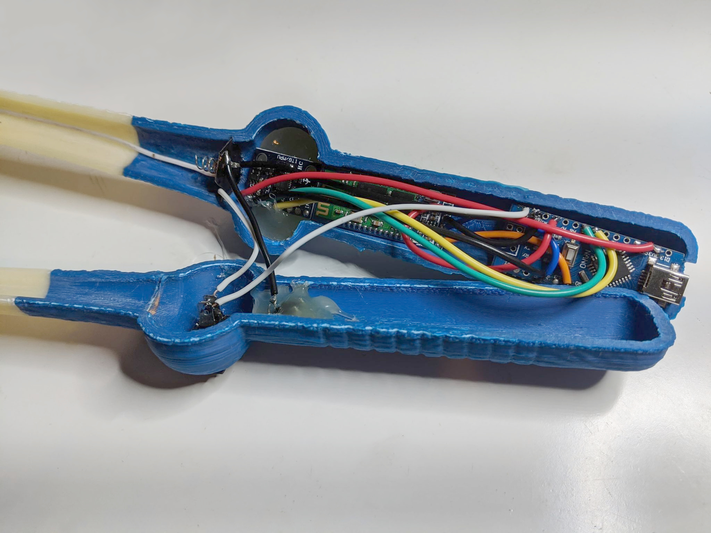

# Windows-Wand
A Harry Potter inspired wand that can detect spells drawn in the air and trigger events within a Windows PC

  

## What is Windows-Wand?
Windows-Wand is a passion project developed by me for my Harry-Potter-obsessed friend's 21st Birthday.

This project utilises machine learning to classify shapes drawn in the air through the use of an accelerometer and gyroscope.

The wand connects to a windows pc, then upon pressing the button, the wand will record the accel/gyro values for the next 2 seconds. During this 2 second window the user draws out the desired spell. This raw accel/gyro data is sent over bluetooth to a companion app that feeds the values as input to a classifier model which then predicts the spell which was drawn out, and activates the associated function.

## What Can the Wand Detect?
The wand is able to detect 25 unique spell patterns. The origin of the spell shapes and names are from The Wizarding World of Harry Potter theme parks and also Harry Potter games.

The following image shows the main UI with all the different spells that can be drawn out and detected.

Each of the 25 spell tiles in the main UI window can be clicked in order to set the desired functionality when the spell is drawn. The following is an example of a spell settings window.

## What Functions is the Wand Able to Perform?
There are 5 categories of functions that the wand is able to perform:
* Keyboard
  * Send characters/strings
  * Press hotkeys
  * Jumble body of text (mixes up the middle letters of words, real world analog of the [tongue-tying curse in the Harry Potter universe](https://harrypotter.fandom.com/wiki/Tongue-Tying_Curse))
* Mouse
  * Click mouse at certain coordinates (Left, Middle, Right)
  * Move the mouse to an absolute position or relative by a specified amount
* Program
  * Launch a program
  * Open a website in the default browser
* Multimedia
  * Mute
  * Volume up
  * Volume down
* Windows
  * Minimise current window
  * Maximise current window
  * Close the active window
  * Lock pc

## Demo Video

## How it Was Made
This project was written in python, the GUI was made using Tkinter and the executable was assembled using pyinstaller.
Each of the 25 spells had 100 training instances, where each training instance is comprised of 20 timesteps of data. Each timestep increments by 0.1 seconds, resulting in 2 seconds of recording for each instance.
Each timestep includes 6 values:
* Acceleration in the x axis
* Acceleration in the y axis
* Acceleration in the z axis
* Gyroscope angle in the x axis
* Gyroscope angle in the y axis
* Gyroscope angle in the z axis

These training instances were collected by manually drawing out each spell in the air with this mock wand rig:

The spell training data can be found in the Training-Data folder

## How to Build
### Parts list:
* Arduino nano
* HC-05 bluetooth module
* 6050 MPU accel/gyro
* 3 AAA batteries
* Tactile Push Button Switch (6x6x5mm)
* KCD11 rocker switch
* Access to 3D printer

### Making the frame:
Print the 7 stl files in the 3D-Models folder

### Schematic:

### Assembly:

### Software
Download the zip file from the Application folder and extract. To connect, open bluetooth settings and pair, then note the COM port for the connection. Open the Windows Wand application and click on any spell tile. In the top right corner there is a field to enter the COM port that the wand is connected to. Simply enter the port and click connect. You should now be able to press the button and draw out the spells and trigger their assigned function!
