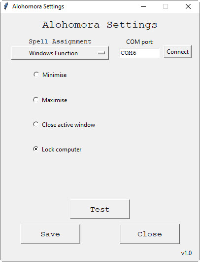

# Windows-Wand
A Harry potter inspired wand that can detect spells drawn in the air and trigger events within a Windows PC

  

## What is Windows-Wand?
Windows-Wand is a passion project developed by me for my Harry-Potter-obsessed friend's 21st Birthday.

This project utilises machine learning to classify shapes drawn in the air through the use of an accelerometer and gyroscope.

The wand connects to a windows pc, then upon pressing the button, the wand will record the accel/gyro values for the next 2 seconds. During this 2 second window the user draws out the desired spell. This raw accel/gyro data is sent over bluetooth to a companion app that feeds the values as input to a classifier model which then predicts the spell which was drawn out, and activates the associated function.

## What Can the Wand Detect?
The wand is able to detect 25 unique spell patterns. The origin of the spell shapes and names are from The Wizarding World of Harry Potter theme parks and also Harry Potter games.

The following image shows the main UI with all the different spells that can be drawn out and detected.

Each of the 25 spell tiles in the main UI window can be clicked in order to set the desired functionality when the spell is drawn. The following is an example of a spell settings window.

## What Functions is the Wand Able to Perform?
There are 5 categories of functions that the wand is able to perform:
* Keyboard
  * Send characters/strings
  * Press hotkeys
  * Jumble body of text (mixes up the middle letters of words, real world analog of the [tongue-tying curse in the Harry Potter universe](https://harrypotter.fandom.com/wiki/Tongue-Tying_Curse))
* Mouse
  * Click mouse at certain coordinates (Left, Middle, Right)
  * Move the mouse to an absolute position or relative by a specified amount
* Program
  * Launch a program
  * Open a website in the default browser
* Multimedia
  * Mute
  * Volume up
  * Volume down
* Windows
  * Minimise current window
  * Maximise current window
  * Close the active window
  * Lock pc
